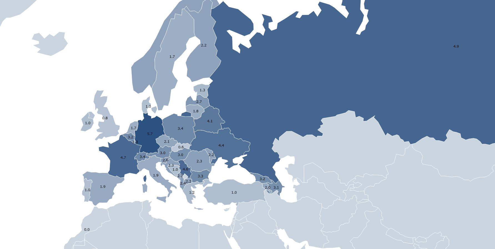

# Does Eurovision have anything to do with music?

This project ranks Eurovision Song Contest country participants as `# received votes from neighbour countries / years participating` to evaluate if claims that the event is no longer a music competition and is based on political voting are true.

The finals data from the [Eurovision song contest scores 1975 - 2018](https://data.world/datagraver/eurovision-song-contest-scores-1975-2018) (which includes televotes since 2016) by [datagraver.com](https://datagraver.com/) and the [country-neighbours](https://github.com/FnTm/country-neighbors/) by [Jānis Peisenieks](https://github.com/FnTm/) datasets were used to create this visualization.

The [ISO 3166-1](https://en.wikipedia.org/wiki/List_of_ISO_3166_country_codes) alpha-2 to ISO 3166-1 alpha-3 lookup table by [Mark DiMarco](https://github.com/markmarkoh) available on [GitHub](https://gist.github.com/markmarkoh/75838f33f7c3af7201a4) was of invaluable help too.

Note some countries weren't present on the datasets, so the modified datasets are also stored on this repo.

## License

This visualization is licensed under the [MIT License](LICENSE).