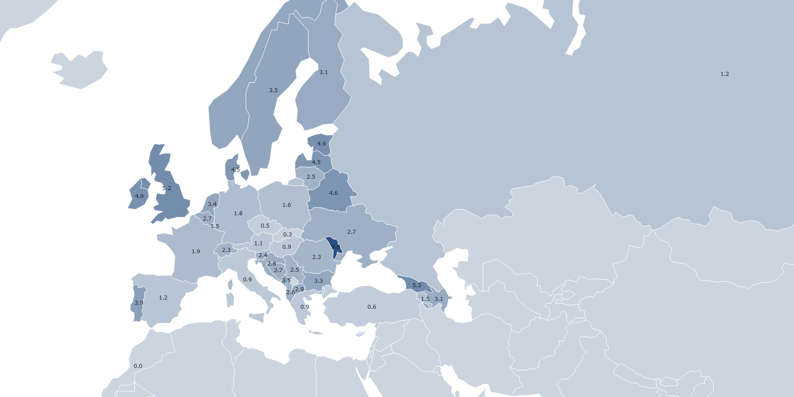

# Does Eurovision have anything to do with music?

This project evaluates the amount of points given to [Eurovision](https://en.wikipedia.org/wiki/Eurovision_Song_Contest) country participants from neighbour countries. The formula used is

The overall goal was to evaluate whether the claims that the event is no longer a music competition and is instead based on political voting are true. The final editions data from the ["Eurovision song contest scores 1975 - 2018"](https://data.world/datagraver/eurovision-song-contest-scores-1975-2018) (which includes televotes since 2016) by [datagraver.com](https://datagraver.com/) and the ["country-neighbours"](https://github.com/FnTm/country-neighbors/) by [Jānis Peisenieks](https://github.com/FnTm/) datasets were used to create this visualization.

Additionally, the [ISO 3166-1](https://en.wikipedia.org/wiki/List_of_ISO_3166_country_codes) alpha-2 to ISO 3166-1 alpha-3 lookup table by [Mark DiMarco](https://github.com/markmarkoh) available on [GitHub](https://gist.github.com/markmarkoh/75838f33f7c3af7201a4) was of invaluable help too.

Note some country data was missing, so the modified datasets are available on the [`src/data`](src/data) directory.

## Data remixes

[u/YenOlass](https://www.reddit.com/user/YenOlass) suggested basing the score on `# neighbour votes / total votes`, which I agree makes a bit more sense and actually corroborates some widely believed hypotheses. Here's the resulting cloropleth:

## License

This visualization is licensed under the [MIT License](LICENSE).